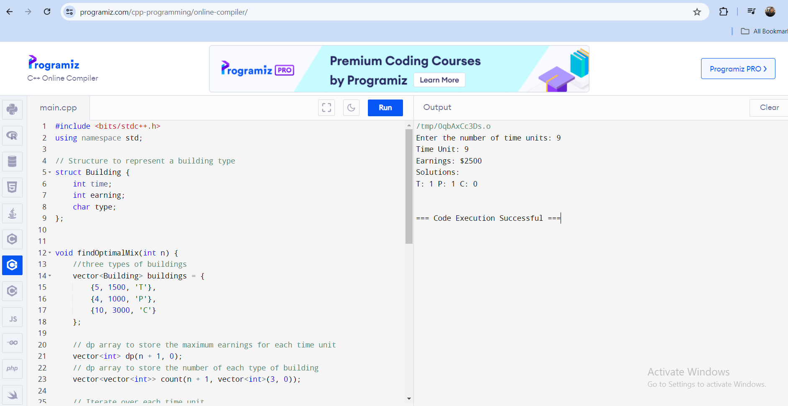
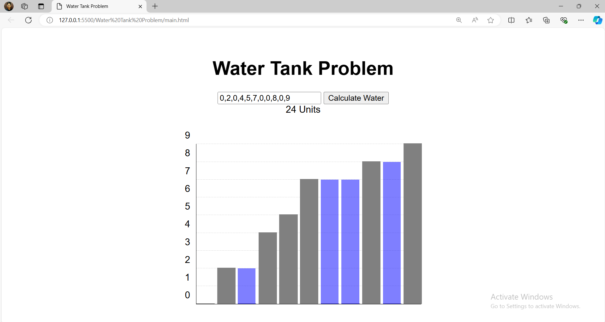

### How to test (Water Tank Problem)
- Copy the code in main.html and run it in any online C++ compiler and give the input to test

### How to test (Water Tank Problem)
- Download the main.html and just open it
- Or
- Copy the code in main.html and run it in any online html compiler

## Developer
- Md Riyaz Ahmed